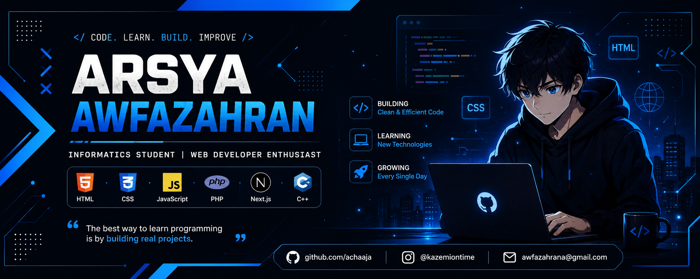

  

# 👋 Hi, I'm Arsya Awfazahran

### 💻 Informatics Student | Web Developer Enthusiast

---

# 👨‍💻 About Me

Hi! Saya **Arsya Awfazahran**, mahasiswa **Program Studi Informatika** di **Universitas Singaperbangsa Karawang**.

Saya memiliki ketertarikan pada **Web Development** dan senang membangun website yang sederhana, responsif, dan mudah digunakan. Saat ini saya terus mengembangkan kemampuan di bidang Front-End maupun Back-End dengan mempelajari teknologi modern seperti **Next.js** dan **PHP**.

Saya percaya bahwa cara terbaik untuk belajar adalah dengan membangun proyek nyata dan terus mengembangkan portofolio.

---

# 📋 Biodata

| Informasi | Keterangan |
|:----------|:-----------|
| 👤 Nama | Arsya Awfazahran |
| 🎓 Program Studi | Informatika |
| 🏫 Universitas | Universitas Singaperbangsa Karawang |
| 💻 Fokus | Web Development |
| 🌱 Sedang Dipelajari | Next.js, PHP |
| 📍 Lokasi | Bekasi, Indonesia |

---

# 🚀 Tech Stack

## 🌐 Front-End

## ⚙️ Back-End

## 💻 Programming Languages

## 🛠 Tools

---

# 🚀 Featured Project

## 🌐 Website Informasi Kelas B

Website informasi kelas yang dibuat menggunakan **HTML**, **CSS**, dan **JavaScript** untuk mempermudah mahasiswa mengakses informasi kelas.

### ✨ Features

- 👥 Struktur Kelas
- 🖼️ Gallery
- 📚 Story
- 👤 Members
- 📱 Responsive Design

### 🌍 Live Demo

https://bicstwnyfive.infinityfree.me/

### 💻 Repository

https://github.com/Kazemicoderai/Website-kelas-B

---

# 📚 Currently Learning

- 🚀 Next.js
- 🐘 PHP
- ⚛️ React
- 🌐 REST API
- 📂 Git Workflow

---

# 📊 GitHub Stats

---

# 📈 Contribution Graph

---

# 💼 Skills

| Skill | Level |
|:------|:-----:|
| HTML | ⭐⭐⭐⭐☆ |
| CSS | ⭐⭐⭐⭐☆ |
| JavaScript | ⭐⭐⭐☆☆ |
| PHP | ⭐⭐☆☆☆ |
| Next.js | ⭐⭐☆☆☆ |
| React | ⭐⭐☆☆☆ |
| C++ | ⭐⭐☆☆☆ |
| Git & GitHub | ⭐⭐⭐☆☆ |

---

# 🎯 Goals

- ✅ Memperdalam JavaScript
- ✅ Menguasai PHP
- ✅ Belajar Next.js
- ✅ Membangun Project Full Stack
- ✅ Belajar MySQL
- ✅ Berkontribusi pada Open Source
- ✅ Mendapatkan Pengalaman Magang

---

# 📫 Connect With Me

---

# 💡 Favorite Quote

> **"Keep Learning, Keep Building, Keep Growing."**

---

### ⭐ Thanks for Visiting My Profile!

Terima kasih telah mengunjungi profil GitHub saya.

Saya selalu terbuka untuk belajar hal baru, menerima masukan, dan berkolaborasi dalam proyek yang bermanfaat.

